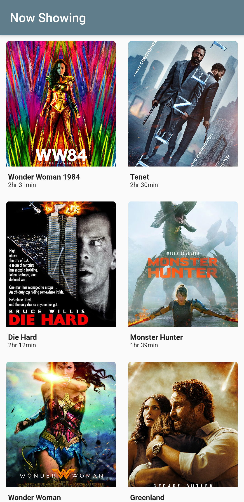

# Cinema Booking Mobile App Prototype
# Use Cases of the prototype
* Users can see a list of movies. Movies should be automatically fetched from the IMDB database. 
* Users can tap on a single movie to see full info including synopsis, genre & poster all fetched from IMDB in real-time. 
* Users can see the schedule of the selected movie. 
* User can tap on a preferred showtime to select it
* Users can see seat map with open & booked seats
* Select Location: users can select a seat location in which they want the ticket booking.
* Confirmation screen for user's ticket
* User can save the confirmation info (ticket) as an image 
* Users can rate  a movie using a star rating scale system (from 5 to 1, highest star for favorite & lowest stars for disappointment). 
# Techniques Used
* Implemented MVVM Design Pattern 
* Bloc Pattern to implement the state management
* Object oriented approach to handle local data across screens

